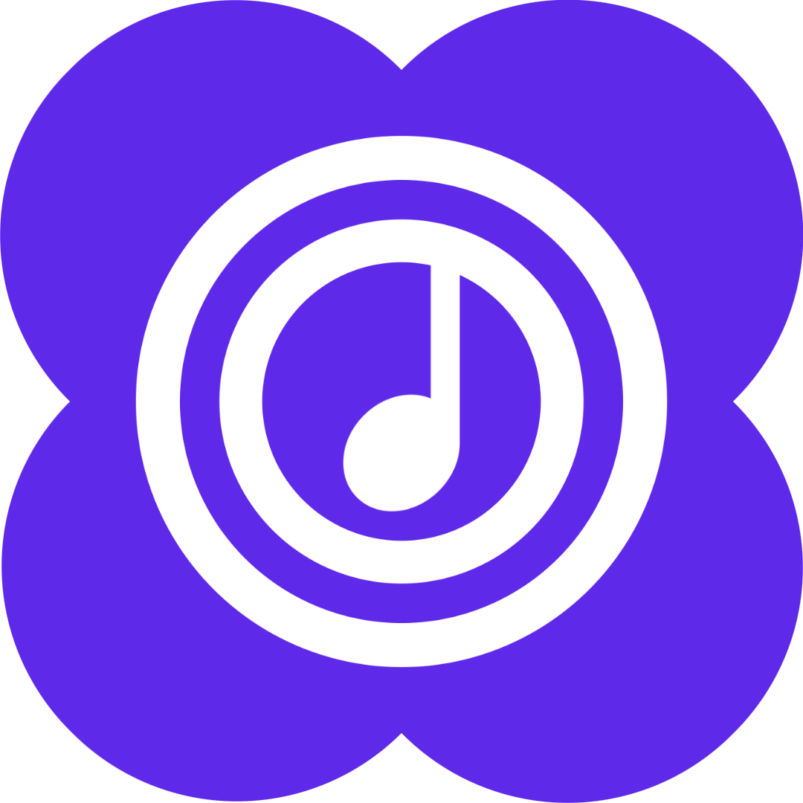
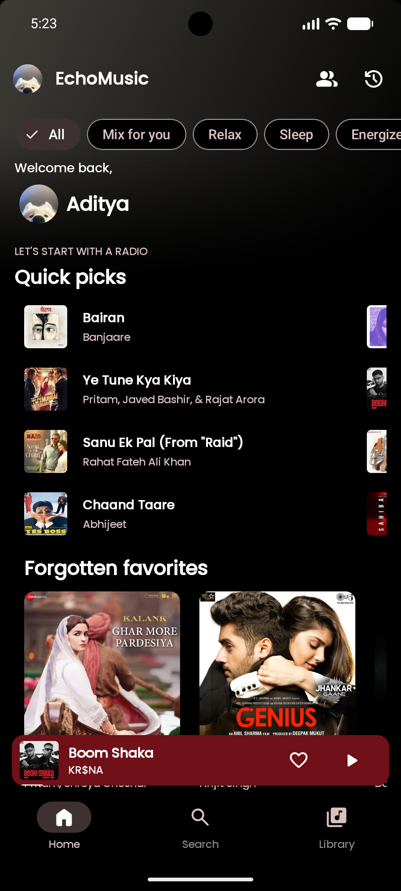
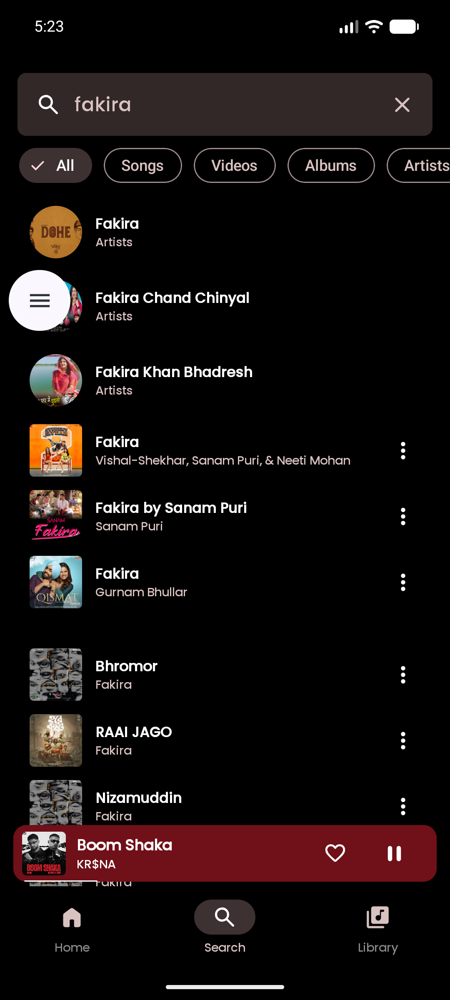
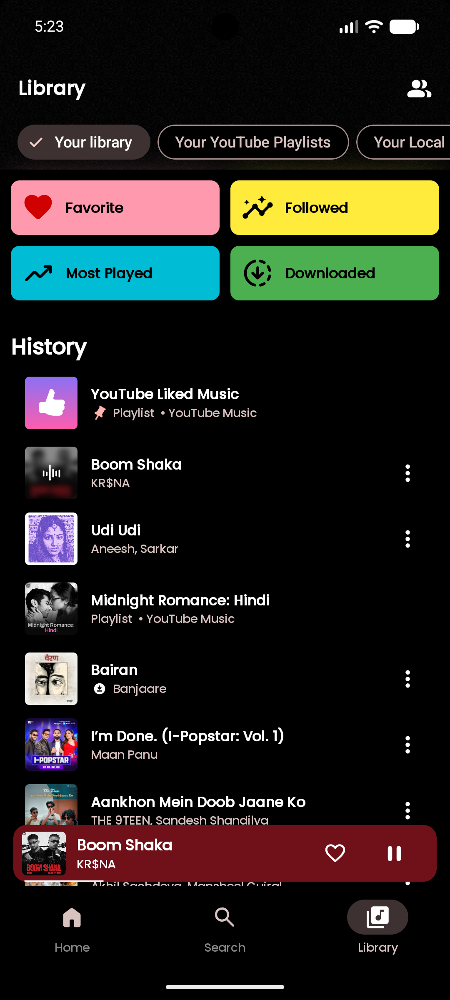

<div align="center">
  

  <h1>Enhanced Echo Music</h1>

  <p><b>A modern Android music app with streaming, synced lyrics, offline playback, and an intuitive user experience.</b></p>

  <p>
    <a href="https://github.com/siliconcode-dev/EchoFork-Music/actions/workflows/android-build.yml"></a>
    <a href="https://github.com/siliconcode-dev/EchoFork-Music/actions/workflows/codeql.yml"></a>
    <a href="LICENSE"></a>
    
    
    
  </p>
</div>

## Table of Contents

- [About this project](#about-this-project)
- [What's different in this fork](#whats-different-in-this-fork)
- [Features](#features)
- [Screenshots](#screenshots)
- [Getting Started](#getting-started)
  - [Requirements](#requirements)
  - [Build from source](#build-from-source)
  - [Optional: Last.fm scrobbling](#optional-lastfm-scrobbling)
  - [Firebase (disabled by default)](#firebase-disabled-by-default)
- [Transfer playlists from Echo Music](#transfer-playlists-from-echo-music)
- [Architecture](#architecture)
- [Contributing](#contributing)
- [Acknowledgements](#acknowledgements)
- [Legal Disclaimer & Terms of Use](#legal-disclaimer--terms-of-use)
- [License](#license)

## About this project

Enhanced Echo Music is a fork of [Echo Music](https://github.com/iad1tya/Echo-Music) by Aditya
([@iad1tya](https://github.com/iad1tya)), which is itself built on top of
[SimpMusic](https://github.com/maxrave-dev/SimpMusic) by
[maxrave-dev](https://github.com/maxrave-dev). Both are GPL-3.0 projects, and this fork continues
under the same license. See [Acknowledgements](#acknowledgements).

This fork exists to build on that foundation — its own visual identity, deeper Material 3
Expressive adoption, refined motion and player UI, and continued modernization of the codebase.

## What's different in this fork

This is a young fork, so the differences today are mostly foundational — more will land over
time. So far:

* **Own identity.** Application ID `echo.music.enhanced` (installs side-by-side with upstream
  Echo Music, no conflict), a violet (`#6C3CE9`) icon and app mark instead of upstream's red, and
  in-app strings updated to "Enhanced Echo Music".
* **Privacy by default.** Firebase Crashlytics and Analytics are **disabled out of the box** —
  see [Firebase](#firebase-disabled-by-default) — so nothing is sent to upstream's Firebase
  project just by using this build.
* **No inherited promo.** Update checks, Discord Rich Presence, and in-app "About" credits point
  at this fork's own repository, not upstream's release feed or Discord application.
* **No ads, no monetization** — see [Legal Disclaimer](#legal-disclaimer--terms-of-use).

Longer-term, the goal is deeper Material 3 Expressive adoption and refined player/motion work —
tracked as it happens, not promised up front.

## Features

**Playback**
* High-quality audio streaming (up to 256kbps for supported accounts).
* Crossfade and gapless playback.
* Video playback support (1080p with subtitles).
* Sleep timer.
* Android Auto integration for in-car listening.

**Discovery**
* Browse charts, podcasts, moods, and genres.
* Comprehensive search across the music catalog.
* AI-based song suggestions.
* Playback data analytics and automated custom playlists.

**Personalization & extras**
* Synced lyrics, with Spotify Canvas visualizations support.
* Light, Dark, and dynamic (Material You) themes.
* Last.fm scrobbling (optional, bring your own API key).

## Screenshots

> Screenshots below are inherited from upstream Echo Music and predate this fork's UI work.

<div align="center">
  
  
  
  
  
</div>

## Getting Started

No pre-built APKs are published yet — build from source for now. Once releases exist they'll be
under this repository's [Releases](https://github.com/siliconcode-dev/EchoFork-Music/releases).

### Requirements

* **JDK 21**
* **Android SDK 37** (min SDK 26)

### Build from source

```bash
git clone https://github.com/siliconcode-dev/EchoFork-Music.git
cd EchoFork-Music
./gradlew assembleDebug
```

The APK is written to `androidApp/build/outputs/apk/debug/`.

### Optional: Last.fm scrobbling

Requires API credentials, or the feature disables itself at runtime. Add to `local.properties`
(gitignored):

```properties
LASTFM_API_KEY=your_key
LASTFM_SECRET=your_secret
```

### Firebase (disabled by default)

Crashlytics and Analytics are **switched off** in this fork. The inherited
`androidApp/google-services.json.disabled` belongs to the upstream project's Firebase account —
building against it would send this app's crash and analytics data to the upstream maintainer.

To enable telemetry, register the `echo.music.enhanced` application ID in your own Firebase
project, add that project's `google-services.json` to `androidApp/`, and uncomment the two
plugin lines in `androidApp/build.gradle.kts`. Crash reporting degrades to logcat until you do.

## Transfer playlists from Echo Music

Playlists can be moved from the upstream Echo Music app using its backup-and-convert flow:

1. **Back up** — in Echo Music, go to **Settings → Backup and Restore → Backup → Local Backup**.
   This writes a `.backup` file to your device.
2. **Convert** — open **https://echomusic.fun/migrate** and upload that `.backup` file. The site
   returns a `.json` file.
3. **Import** — in Enhanced Echo Music, go to **Settings → Backup and Restore → Import Playlists**
   and pick the converted `.json`.

> The migration site is operated by the upstream Echo Music project, not by this fork.

## Architecture

Enhanced Echo Music uses a modern Android and Kotlin Multiplatform (KMP) architecture.

* **Kotlin Multiplatform (KMP):** Core business logic, domain models, and data access layers live
  under `core/`. Upstream tracked this as a Git submodule; this fork vendors it directly so the
  shared logic can be modified alongside the app.
* **UI Layer:** Built entirely with Jetpack Compose (Material 3 Expressive).
* **Media Playback:** AndroidX Media3 (ExoPlayer), handling audio streams, local caching, and
  gapless transitions.
* **Dependency Injection:** Koin, decoupling module lifecycles and simplifying testing.
* **Local Storage:** Room for structured local data (playlists, favorites, cache metadata);
  DataStore for user preferences.
* **Modularization:** Split by feature and layer (`:data`, `:domain`, `:media3`, `:spotify`,
  `:lyricsService`, and others — see `settings.gradle.kts`).

## Contributing

Contributions are welcome. See [CONTRIBUTING.md](CONTRIBUTING.md) for the full workflow —
briefly: fork, branch, make sure `./gradlew assembleDebug` and `./gradlew lint` pass, then open a
pull request against `main`. Bug reports and feature requests use the templates under
[Issues](https://github.com/siliconcode-dev/EchoFork-Music/issues).

## Acknowledgements

This project stands on work by others:

* **[Echo Music](https://github.com/iad1tya/Echo-Music)** by Aditya
  ([@iad1tya](https://github.com/iad1tya)) — the direct upstream of this fork.
* **[SimpMusic](https://github.com/maxrave-dev/SimpMusic)** by
  [maxrave-dev](https://github.com/maxrave-dev) — the foundation Echo Music itself builds on.

If you find this software valuable, please consider supporting the **upstream** developers, who
did the bulk of this work:

<div align="center">
  <a href="https://buymeacoffee.com/iad1tya"></a>
  <a href="https://www.patreon.com/cw/iad1tya"></a>
</div>

## Legal Disclaimer & Terms of Use

**1. Free & Open-Source**
Enhanced Echo Music is a 100% free, open-source (FOSS) application built for educational purposes
and personal use. This fork contains no advertisements, no premium tier, no subscriptions, and no
monetization of any kind.

**2. How It Works**
The app functions as a specialized client that parses publicly available content and APIs of
YouTube and YouTube Music, displaying them in a custom interface. It does not modify or bypass
content protections.

**3. Support Creators**
We respect the work of artists and content creators. Users are encouraged to subscribe to
[YouTube Premium](https://www.youtube.com/premium) to directly support the creators they listen
to. This app is a developer proof-of-concept, not a way to reduce creator revenue.

**4. No Hosted Content**
This app does not host, upload, or store any audio, video, or copyrighted media. All content
remains hosted on Google/YouTube's servers and is the property of its respective owners.

**5. Third-Party Services**
The app talks to a number of third-party services, some via official APIs (Last.fm, LRCLIB,
SponsorBlock) and some via unofficial or reverse-engineered endpoints (YouTube Music, Spotify,
Apple Music lyrics). Availability of those endpoints is outside this project's control and may
break without notice. Using them may conflict with those platforms' Terms of Service — that
choice, and the accounts you sign in with, are yours.

**6. User Responsibility**
This software is provided "AS IS," without warranty of any kind. Users are solely responsible for
ensuring their use complies with local copyright laws and platform Terms of Service. No media is
hosted by this project, so it cannot process DMCA takedowns for audio/video content.

## License

Enhanced Echo Music is licensed under the GPL-3.0 License, inherited from Echo Music and
SimpMusic. See the [LICENSE](LICENSE) file for details.
